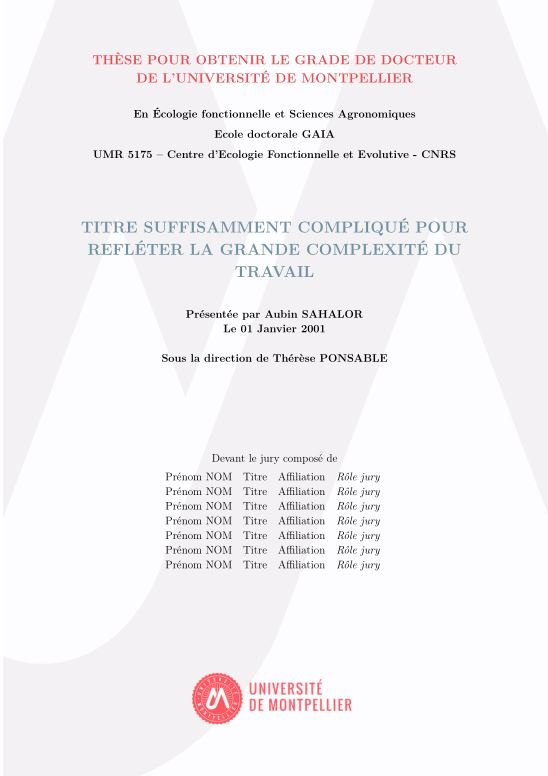

# Université de Montpellier thesis template

🎓 This is the template developped for **PhD students of the Université de Montpellier**.
A preview of the pdf is available [here](https://gitlab.com/v_vandermeersch/um_thesis_template/-/blob/master/index.pdf).

👉 This template is adapted from **Sylvain Schmitt's** [**PhD template**](https://github.com/sylvainschmitt/PhD).



## Prerequesite

You'll need to have the following softwares installed on your computer:

* [R](https://www.r-project.org/) 
* [Rstudio](https://rstudio.com/)

You'll need the following R packages with associated dependencies:

* [`rmarkdown`](https://rmarkdown.rstudio.com/)
* [`bookdown`](https://bookdown.org/)
* [`tinytex`](https://yihui.org/tinytex/r/)

## Installation

Download this GitLab repository or clone it with `git`:

```
git clone git@gitlab.com:v_vandermeersch/um_thesis_template.git
```

## Template structure

[`Latex` files](https://gitlab.com/v_vandermeersch/um_thesis_template/-/tree/master/latex):

* Template
* Title page
* Abstract (English and French)

[`Rmarkdown` files](https://gitlab.com/v_vandermeersch/um_thesis_template/-/tree/master/contents):

* Acknowledgments
* *Résumé substantiel* (in French)
* Introduction
* Chapters, and so on...

## Getting started

Start by filling your informations in the `YAML` header of the [`index.Rmd`](https://gitlab.com/v_vandermeersch/um_thesis_template/-/blob/master/index.Rmd):

```
title: "TITRE SUFFISAMMENT COMPLIQUÉ POUR REFLÉTER LA GRANDE COMPLEXITÉ DU TRAVAIL"
author: 'Aubin SAHALOR'
date: '01 Janvier 2001'
supervisor: 'Thérèse PONSABLE'
specialty: 'Écologie fonctionnelle et Sciences Agronomiques'
department: 'UMR 5175 – Centre d’Ecologie Fonctionnelle et Evolutive - CNRS'
```

## Adding a chapter

:pencil: Create a `05-Chapter1.Rmd` file in [`/contents`](https://gitlab.com/v_vandermeersch/um_thesis_template/-/tree/master/contents).
Call this file in the [`index.Rmd`](https://gitlab.com/v_vandermeersch/um_thesis_template/-/blob/master/index.Rmd):

```
<!-- Call the child documents -->
```{r body, child = c('contents/01-Acknowledgments.Rmd', 'contents/02-TOC.Rmd', 'contents/03-Resume.Rmd', 'contents/04-Introduction.Rmd',
'contents/05-Chapter1.Rmd')}```
```
